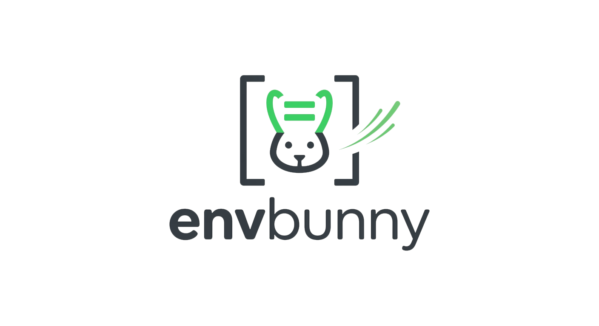

<p align="center">
  
</p>

# EnvBunny

A native macOS application for managing environment variables across multiple environments. Create, edit, and switch between development, staging, production (or any custom) environments with a single click — automatically updating your `.zshrc` and a flat `.env` file.

Built with SwiftUI and Swift Package Manager. No Xcode project required.

## Features

- **Multiple environments** — Create as many named environments as you need (dev, staging, production, etc.)
- **One-click apply** — Switch your entire shell environment instantly; updates `~/.zshrc` with `export` statements and writes a flat `.env` file
- **Stale variable cleanup** — When switching environments, variables from the previous environment that aren't in the new one are automatically `unset`
- **Import / Export** — Import an existing `.env` file as a new environment, or export any environment to a `.env` file
- **Duplicate & Rename** — Clone environments or rename them via right-click context menu
- **Input validation** — Keys are validated against `[A-Za-z_][A-Za-z0-9_]*` with real-time feedback; duplicate keys are prevented
- **Safe `.zshrc` modification** — Only a clearly marked managed block between sentinel comments is ever touched; a timestamped backup is created before every write
- **Secure storage** — All config files use owner-only permissions (700 for directories, 600 for files); writes are atomic to prevent corruption

## Requirements

- macOS 14 (Sonoma) or later
- Swift 6.2+ toolchain (included with Xcode 16+)
- zsh (default shell on macOS)

## Installation

### From DMG (recommended)

Download the latest `.dmg` from [Releases](../../releases), open it, and drag **EnvBunny** to your Applications folder.

### Build from source

```bash
git clone https://github.com/sauravkoli31/environment-manager.git
cd environment-manager
./build.sh
```

The script compiles a release binary, assembles a `.app` bundle, and packages it into a DMG at `build/EnvBunny-<version>.dmg`. The minor version is auto-incremented on each build.

To run directly during development:

```bash
swift run
```

## How It Works

```
environments.json (source of truth)
        │
        ▼
   ┌─────────┐
   │   App    │  ← Create / edit environments here
   └─────────┘
        │
        ▼  (on "Apply")
   ┌──────────────────────────────────────────┐
   │ ~/.config/environment-manager/.env       │  ← Flat KEY=value file
   │ ~/.zshrc (managed block only)            │  ← export KEY="value" statements
   └──────────────────────────────────────────┘
```

When you click **Apply**, the app:

1. Writes the selected environment's variables to `~/.config/environment-manager/.env` as a flat `KEY=value` file.
2. Updates `~/.zshrc` by replacing the managed block between sentinel comments:
   ```zsh
   # --- ENVIRONMENT MANAGER START (DO NOT EDIT) ---
   unset OLD_KEY_NO_LONGER_NEEDED
   export API_URL="https://api.example.com"
   export DEBUG="false"
   # Active: production
   # --- ENVIRONMENT MANAGER END ---
   ```
3. Creates a timestamped backup of your `.zshrc` at `~/.config/environment-manager/backups/`.

Open a new terminal (or run `source ~/.zshrc`) to pick up the changes.

## File Locations

| File | Path | Permissions |
|------|------|-------------|
| Config & environments | `~/.config/environment-manager/environments.json` | 600 |
| Flat `.env` output | `~/.config/environment-manager/.env` | 600 |
| `.zshrc` backups | `~/.config/environment-manager/backups/` | 700 (dir), 600 (files) |
| Config directory | `~/.config/environment-manager/` | 700 |

## Project Structure

```
Sources/
├── App/
│   └── EnvBunnyApp.swift              # Entry point, window config, AppDelegate
├── Models/
│   ├── Environment.swift              # EnvironmentVariable, AppEnvironment
│   └── AppConfig.swift                # Root config model
├── Services/
│   ├── ConfigService.swift            # JSON persistence (environments.json)
│   ├── EnvFileService.swift           # Flat .env file writer
│   └── ZshrcService.swift             # .zshrc managed block, backups, shell escaping
├── ViewModels/
│   └── EnvironmentViewModel.swift     # @Observable MVVM state, CRUD, apply logic
└── Views/
    ├── ContentView.swift              # NavigationSplitView two-panel layout
    ├── Sidebar/
    │   ├── EnvironmentListView.swift   # Environment list, context menu, rename
    │   └── EnvironmentRowView.swift    # Row with active indicator + variable count
    ├── Editor/
    │   ├── VariableEditorView.swift    # Variable table, add form, validation
    │   └── VariableRowView.swift       # Inline editable KEY=value row
    └── Components/
        ├── ApplyButton.swift           # Apply with confirmation dialog
        ├── NewEnvironmentSheet.swift   # Create environment modal
        └── ImportExportView.swift      # Import/export .env files
```

## Tech Stack

| Component | Choice |
|-----------|--------|
| Language | Swift 6.2 |
| UI | SwiftUI |
| Architecture | MVVM with `@Observable` |
| Build system | Swift Package Manager |
| Platform | macOS 14+ |
| Dependencies | None (stdlib + SwiftUI only) |

## License

MIT
